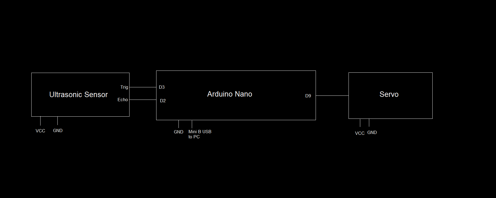
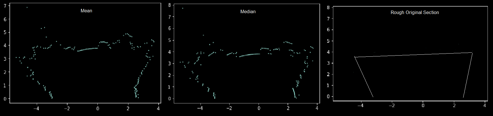

# Project Hollowgraph

## Brief

### Aim

This project aims to explore the possibility of using ultrasonic sensor data to construct a 3 dimensional render of an enclosure.

### Technologies used

- [Arduino Nano](https://store.arduino.cc/products/arduino-nano)
- [HC-SR04](https://robu.in/product/hc-sr04-ultrasonic-range-finder/) , Ultrasonic sensor compatible with arduino
- [TowerPro SG90](https://robu.in/product/towerpro-sg90-9g-mini-servo-9-gram/), 180 degree mini servo
- [Arduino IDE](https://www.arduino.cc/en/software/), used for programming the Arduino.
- [puTTY](https://www.putty.org/), captures data from the serial and logs it into a csv
- Python on Jupyter notebook is used for data processing. Specific packages used: [Pandas](https://pandas.pydata.org/) for data processing and [Matplotlib](https://matplotlib.org/) for visualisation.
- [p5.js](https://p5js.org/) with [WEBGL](https://developer.mozilla.org/en-US/docs/Web/API/WebGL_API) is used for rendering a 3 dimensional plot of the figure.

### The project is divided into three parts

- Hardware - An ultrasonic sensor is mounted on top of a 180 degree servo, both of which are hooked up to an Arduino which prompts the sensor to take readings at every 1 degree. There are different programs in `/src/ard_code/` that perform data collection. The data is passed on to puTTY which then logs it into a csv file which is then used by the data processors.
- Data Processing - `/src/data_proc/` contains a jupyter notebook which is used to study data and find ways to manipulate it for the better. The python script has raw implementation of building and smoothening data which can be directly used by providing command line inputs. This processed data is then passed on to the renderer.
- Rendering - `/src/render/` contains index.js, which handles all the rendering. A server needs to be started in the root of the repository for the javascript file to access the csv.

The end result of the project is to generate a 3d render of an enclosure. The project is designed to do this by stitching 2d arcs on one axis. The end result serves the purpose of just qualitative analysis like terrain analysis.

## Expanded

### Hardware

The circuit as shown above is pretty simple to execute (An independent constant 5V power supply is recommended). The driver code is what mainly does the job. All the driver programs are stored in `/src/ard_code/`. The folder has three different programs, but the main driver is ard_code_1. The other two are mainly used for testing and debugging. `ard_code` can be used for testing both the servo and the sensor, it moves the sensor clockwise 180 degrees taking readings every two degrees and then sweeps back anti-clockwise taking readings every two degrees and averaging it with the values from the previous sweep and finally prints the result onto the Serial Monitor. Another interesting test that be done here is by un-commenting the last line `sweep = !sweep`, this makes the sensor read data for alternate angles, i.e. readings at 0 degree, 2 degree, 4 degree, etc on the first clockwise sweep and the odd angles on the anti-clockwise sweep. Data obtained through this has been seen to be a little bit different from that of other methods, this might be used to understand outliers better (depends on the surface being scanned). `ard_code_2` can be used for sensor testing, the sensor can be manually pointed to a definite direction and the readings are printed onto the Serial Monitor continually. This routine was used to understand the behaviour of the sensor on curves and vertices, parameters like SWEEP_DELAY can also be used to experiment with the consistency of the sensor.

The basic operation of `ard_code_1` is to take readings every one degree and print it to the console. The sophistication lies in the parameters: OBSERVATIONS, LIMIT and SWEEP_DELAY. Brief note on each parameter:

- OBSERVATIONS - sets the number of consecutive observations for each angle.
- LIMIT - this is set by the user after a rough manual inspection of the subject. If a reading crosses this limit, it gets discarded. A high value results in erroneous results.
- SWEEP_DELAY - this is the time between each complete observation. keeping this too low results in erroneous results from stray echoes.

The final format of the data from ard_code_1 is: each group of 181 rows correspond to each angle (0 to 180) and total number of columns correspond to the number of observations for each angle.

Note: Every round of observation for ard_code_1 and ard_code starts with the user inputting an arbitrary character to the Serial.

[PuTTY](https://www.putty.org/) is used for logging results from the Serial into a csv file.

Assumptions, problems and proposed solutions:

- Speed of sound is assumed to be 343 m/s. Small fluctuations in this can cause readings to skew unexpectedly.
- The surface below the device is assumed to be smooth and plain that results in the sensor always normal to the surface above, this is not a natural situation. This can be somewhat remedied with the use of an array of proximity sensors on the bottom of the device, data from which can be processed to get an estimate of the tilt angle.
- The sensor used in this project is quite inefficient in working around corners and curves. These situations lead to missed echoes which move around the environment as stray echoes and are detected later which result in a higher distance value which is obviously not right. Better sensors can be used to remedy this problem.
- [Spread spectrum phased array](https://www.hackster.io/graham_chow/spread-spectrum-phased-array-sonar-018e22) can be used to increase efficiency and range.

### Data Processing

All the data processing programs are contained in the `src/data_proc/` folder. It contains two files: build_data.py and [data_processing_1.ipynb](https://github.com/Ra20r/Project-Hollowgraph/blob/main/src/data_proc/data_processing_1.ipynb). The Jupyter Notebook deals with the analysis of the data and is well annotated. The build_data.py is the utility routine based on the observations from the Jupyter Notebook and can be used to build data using command line arguments accessed using `python3 build_data.py -h` (currently unstable).

### Rendering Software

All data processing is done considering single 2d arcs which are then stitched together to get data for a 3d picture. `src/render/` contains everything needed to render using processed data from a csv file. `index.js` can access the data from a file named `data.csv` from `data` folder. In order to do this, the script also requires a server be opened in the root of the repository on port 5500. The script uses canvas to generate the render and then also integrates mouse and keyboard actions for observation.

### Applications

Current version of this project has a lot of assumptions and flaws which can be remedied. More sophisticated models built on this can be used for various applications from terrain mapping to space exploration. The potential is unfathomable. Last but not least, it would be insanely cool to have something map a 3d space and put up a hologram of it, maybe, in the future.
